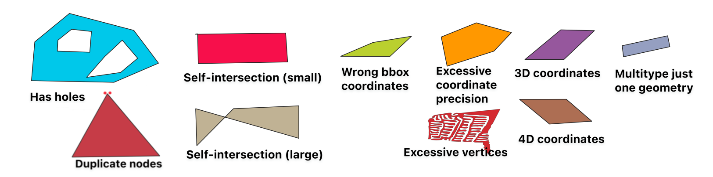

# 🗺️ geojson-invalid-geometry

**List of GeoJSON invalid geometry issues with example files**

Ever encountered an *invalid geometry* error when dealing with GeoJSON? Even if a GeoJSON conforms to the
[GeoJSON specification](https://geojson.org/), some tools or APIs might have issues with it.
This repo shows the common issues when handling GeoJSON geometries and how to fix them.
For a general introduction to GeoJSON see [here](https://macwright.com/2015/03/23/geojson-second-bite.html).

## Invalid by GeoJSON specification

### Unclosed 
The first and last node (corner point, also called vertex/vertices) of a **Polygon's** exterior ring (shell) or inner ring (hole) 
must be the same, i.e. have identical values. This signifies the start and endpoint of a closed Polygon. 
[Spec](https://www.rfc-editor.org/rfc/rfc7946#section-3.1.6),
[Example](examples/invalid_geometries/invalid_unclosed.geojson)

### Duplicate nodes
No two nodes of a **Polygon/LineString** can be the same, except the first and last node of a Polygon (see "unclosed" rule above).
[Spec](https://www.rfc-editor.org/rfc/rfc7946#section-3.1.6), 
[Example](examples/invalid_geometries/invalid_duplicate_nodes.geojson)

### Less than three unique nodes
A **Polygon's** exterior ring and inner ring must have four or more nodes: Three or more unique coordinate positions plus
the first and last node must be the equivalent to close the Polygon (see above). Otherwise the Polygon would not cover an area.
[Spec](https://www.rfc-editor.org/rfc/rfc7946#section-3.1.6),
[Example](examples/invalid_geometries/invalid_less_three_unique_nodes.geojson)

### Exterior not counter-clockwise winding order
A **Polygon's** exterior ring must have counterclockwise winding order (often abbreviated ccw). This is often 
overlooked when manually creating Polygons or converting from other formats. As an older specification version did not 
define the winding order, most tools will accept Polygons with invalid winding order, but not all.   
In this context, many definitions use the term "right-hand rule": If you would walk along the ring in the order of the 
coordinates, if the area enclosed by the ring is on your right-hand side, it has a clockwise winding order; if it is on 
your left-hand side, it has a counter-clockwise winding order.
[Spec](https://www.rfc-editor.org/rfc/rfc7946#section-3.1.6),
[Example - Exterior](examples/invalid_geometries/invalid_exterior_not_ccw.geojson)

### Interior not clockwise winding order
The inner rings (define hole cutouts) of a **Polygon** must be clockwise (often abbreviated cw). For more details also see 
the "exterior not ccw" criterium above. 
[Example - Interior](examples/invalid_geometries/invalid_interior_not_cw.geojson)

### Inner and exterior Polygon rings intersect or cross
The inner ring of a **Polygon** must not intersect or cross the exterior ring. Also, no two inner rings
may intersect or cross each other. The inner and exterior ring, as well as two inner rings may touch at a single point
only.
[Example](examples/invalid_geometries/invalid_inner_and_exterior_ring_intersect.geojson)

### Outside latitude/longitude boundary
The GeoJSON specification defines all GeoJSON as being in the [WGS84](https://de.wikipedia.org/wiki/World_Geodetic_System_1984)
coordinate reference system (CRS) with latitude / longitude decimal coordinates. Latitudes are specified within the range of [-90, 90]
and Longitudes within [-180, 180].
[Example](examples/invalid_geometries/invalid_outside_lat_lon_boundaries.geojson)

### Coordinate reference system (CRS) defined
The GeoJSON specification defines all GeoJSON as being in the [WGS84](https://de.wikipedia.org/wiki/World_Geodetic_System_1984)
coordinate reference system (CRS) with latitude / longitude decimal coordinates. Thus, the CRS does not need to be
specified in the GeoJSON. In older GeoJSON specifications you could define alternative crs (as a "crs" key in the FeatureCollection).
However this leads to interoperability issues with many tools/APIs, as they ignore the crs definition and assume 
latitude/longitude coordinates (WGS84).
[Spec](https://www.rfc-editor.org/rfc/rfc7946#section-4),
[Example](examples/invalid_geometries/invalid_crs_defined.geojson)

### Zero-length LineString
A **LineString** with identical start and end node coordinates. A valid LineString contains two or more distinct positions.
[Spec](https://www.rfc-editor.org/rfc/rfc7946#section-3.1.4),
[Example](examples/invalid_geometries/invalid_zero_length_linestring.geojson)

### Incorrect geometry data type
For example, a geometry that can be identified as a Polygon by its shape, has the geometry `type` defined as another
type, e.g. LineString. Similarly when a single geometry object (e.g., Point, LineString or Polygon) has multiple, disconnected 
parts that should be represented as a MultiPoint, MultiLineString or MultiPolygon.
[Example](examples/invalid_geometries/invalid_incorrect_geometry_data_type.geojson)

 

## Valid but problematic for some tools/APIs 

### Holes
A **Polygon** is allowed to have hole cutouts, this is a feature, not an issue. However, some APIs don't accept
Polygon geometries with holes as input (e.g. some satellite data providers where the desired area is relevant for
pricing). The holes can be removed by removing the
Polygon's [inner ring](https://macwright.com/2015/03/23/geojson-second-bite.html#polygons) coordinates. 
[Example](examples/problematic_geometies/problematic_holes.geojson)

### Self-intersection
Here one or multiple parts of a **Polygon** overlap another part of itself. Often found in complex geometry shapes,
after geometry operations without careful cleanup (buffer, raster-to-vector etc.).
A Polygon is allowed to have self-intersections, this conforms with the GeoJSON specification. However, it frequently
causes issues in downstream applications thus is often rejected by APIs and tools.

A common approach for removing the self-intersections is applying a zero-buffer operation (e.g. `.buffer(0)` in
shapely). This dissolves the overlapping areas and usually is an okay solution for small, undesired self-intersections.
However, especially for larger self-intersections (see example 2) this might lead to unintended changes of the geometry, 
as significant parts of the geometry could be removed by the operation. Here only a manual operation can fix the issue, 
by splitting of the geometry into multiple parts, or adding/removing nodes.
[Example 1 - Small](examples/problematic_geometies/problematic_self_intersection_small.geojson) 
[Example 2 - Large](examples/problematic_geometies/problematic_self_intersection_large.geojson)

### Excessive coordinate precision
Although not mandatory, the GeoJSON specification recommends a coordinate precision of 6 decimal places. Using more
than 6 decimal places may lead to issues with some tools/APIs and unnecessarily increase the file size (6 decimal places
corresponds to about 10cm of a GPS).
[Spec](https://www.rfc-editor.org/rfc/rfc7946#section-11.2),
[Example](examples/problematic_geometies/problematic_excessive_coordinate_precision.geojson)

### Excessive vertices
Some tools might have an issue with very complex geometries that have many vertices (nodes), e.g. some APIs limit it to 
less than 1000. Even simple geometries can have a high number of nodes, e.g. when a straight line contains additional nodes.
[Example (1223 vertices)](examples/problematic_geometies/problematic_excessive_vertices.geojson)

### 3D or more coordinates not accepted
A geometry's nodes/positions/vertices should consist of either two coordinates (order `[longitude, latitude]`) or three
coordinates (`[longitude, latitude, elevation]`). Elevation is optional. Some tools and APIs may not accept 3D coordinates.

In early versions of the GeoJSON specification, it was normal to store more than three coordinates, e.g. storing additional 
information like time etc. Technically still allowed but [discouraged](https://www.rfc-editor.org/rfc/rfc7946#section-3.1.1) 
by the current specification, if used in some tools or APIs this may lead to errors or the additional values being ignored. 
The additional information should now be stored separately in the properties of the feature.
[Example 1 - 3D coordinates](examples/problematic_geometies/problematic_3d_coordinates.geojson)

### Crosses anti-meridian
A **Polygon/LineString** that extends across the 180th meridian can lead to interoperability issues, and instead
should be cut in two as a MultiPolygon or MultiLineString. The anti-meridian goes in vertical direction (north-south), 
the longitude at this line can be given as either east or west. A geometry crossing it would thus go over it from left to right
or vice-versa. Also see ["The 180th Meridian"](https://macwright.com/2016/09/26/the-180th-meridian.html) by Tom MacWright.
[Spec](https://www.rfc-editor.org/rfc/rfc7946#section-3.1.9),
[Example](examples/problematic_geometies/problematic_crosses_antimeridian.geojson)

### Wrong bounding box coordinate order
A `bbox` may be defined (but is not required) in the GeoJSON object to summarize the extent on the level of Geometries,
Features, or FeatureCollections. If it is defined, the bbox coordinate order must conform
to `[west, south, east, north]`.
[Spec](https://www.rfc-editor.org/rfc/rfc7946#section-3),
[Example](examples/problematic_geometies/problematic_wrong_bbox_coordinate_order.geojson)

### Multi-type Geometry with just one geometry object
A **MultiPoint/MultiLineString/MultiPolygon** should represent multiple geometries of the same type
(e.g. multiple Polygons within a MultiPolygon). While it is not invalid according to the GeoJSON specification, if
a Multi-type object only contains a single geometry object, some tools might complain.
[Example](examples/problematic_geometies/problematic_multitype_geometry_with_just_one_geometry.geojson)

### Feature has no geometry
A GeoJSON Feature is allowed to be un-located, meaning it has `null` as a geometry member, see
[spec](https://www.rfc-editor.org/rfc/rfc7946#section-3.2). But some tools/APIs might expect a geometry and complain.
[Example](examples/problematic_geometies/problematic_feature_null_geometry.geojson)

### Geometry or Feature not wrapped in a Feature or FeatureCollection
The GeoJSON specification allows not wrapping geometry or feature objects in a FeatureCollection,
see [spec](https://www.rfc-editor.org/rfc/rfc7946#section-2). Any GeoJSON object on its own is still a valid GeoJSON. 
However, some tools might expect a Feature and FeatureCollection and the associated properties.